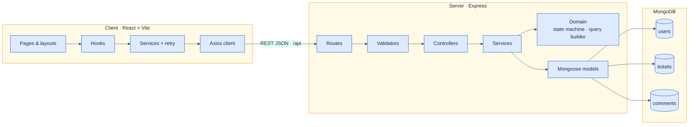

# Ticket Management System

A MERN-based helpdesk application for creating, tracking, and resolving support tickets. Operators can move work through a controlled status lifecycle, search and filter the queue, and collaborate with comments — all behind a layered Express API and a React single-page app.

> **Quick start:** install dependencies in `server/` and `client/`, copy the `.env.example` files, start MongoDB, run `npm run seed` in `server/`, then `npm run dev` in both packages.

---

## Table of contents

1. [What this project does](#what-this-project-does)
2. [System architecture](#system-architecture)
3. [Capabilities](#capabilities)
4. [Tech stack](#tech-stack)
5. [Getting started](#getting-started)
6. [Configuration](#configuration)
7. [Database](#database)
8. [Running the API](#running-the-api)
9. [Running the UI](#running-the-ui)
10. [Tests](#tests)
11. [Demo seed data](#demo-seed-data)
12. [Repository layout](#repository-layout)
13. [Known gaps](#known-gaps)
14. [Further reading](#further-reading)

---

## What this project does

This repository implements a **Support Ticket Management System** intended for assessment and local demos. It models a small internal helpdesk:

| Area | Behavior |
|------|----------|
| Tickets | Create, view, edit, soft-delete |
| Lifecycle | Server-enforced status transitions |
| Collaboration | Comment threads on tickets |
| Discovery | Keyword search, status/priority filters, sorting, pagination |
| Operations view | Dashboard with status counts and recent tickets |

The server keeps validation, domain rules, and persistence in separate layers. The client talks to the API through Axios services and reusable React hooks, with loading, error, and toast feedback on major flows.

---

## System architecture

The application is a **monorepo** with two runtimes and one database:



### How a request moves through the stack

1. The SPA calls a method in `client/src/services/` (transient network/5xx failures may be retried).
2. Express matches a route and runs `express-validator` chains.
3. The controller forwards to a service — controllers stay thin.
4. Services apply business rules (including the status state machine) and talk to Mongoose.
5. Failures are mapped by a global handler into one JSON error shape.

### Standard error envelope

```json
{
  "error": {
    "code": "VALIDATION_ERROR",
    "message": "Validation failed",
    "details": {
      "title": "Title is required"
    }
  }
}
```

Common codes include `VALIDATION_ERROR`, `NOT_FOUND`, and `INVALID_TRANSITION` (`409` when a status change is not allowed).

---

## Capabilities

### Included in core scope

| Capability | Notes |
|------------|--------|
| Ticket CRUD | Soft delete via `deletedAt`; deleted rows are excluded from lists and return `404` on direct fetch |
| Status state machine | Dedicated `PATCH /api/tickets/:id/status` endpoint |
| Comments | Nested under tickets; author must be a valid user |
| Search | MongoDB text index on title/description; regex fallback for special characters |
| Filters & sort | Status, priority, plus `sortBy` / `sortOrder` on the list API and UI |
| Pagination | `page` / `limit` with `total` and `totalPages` |
| Validation | Shared field validators for writes and list query params |
| Errors & logging | Typed errors, 404 handler, Mongoose error mapping, request logging |
| Dashboard | Status summary cards and a recent-tickets table |
| Seed script | Deterministic demo users, tickets, and comments |

### Allowed status transitions

```
open         →  in_progress , cancelled
in_progress  →  resolved    , cancelled
resolved     →  closed
closed       →  (end state)
cancelled    →  (end state)
```

Anything outside this map is rejected with **409 Conflict** and a readable explanation.

### Stretch (scaffolded only)

- JWT login and protected routes  
- Role-based access control (roles exist on users but are not enforced)  
- `/login` page stub in the client  

---

## Tech stack

| Layer | Choices |
|-------|---------|
| Data | MongoDB · Mongoose |
| API | Node.js · Express · express-validator |
| UI | React 18 · React Router · Vite |
| HTTP | Axios (+ small retry helper) |
| Tests | Jest · Supertest · Vitest · Testing Library · mongodb-memory-server |
| Local DX | nodemon |

---

## Getting started

### Prerequisites

- Node.js **18+** (20+ preferred)  
- npm **9+**  
- MongoDB **6+** (local process or Atlas URI)

### Install

```bash
git clone https://github.com/Anuragmalhotra/ticket-management-system.git
cd ticket-management-system

cd server && npm install
cd ../client && npm install
```

Next: create env files ([Configuration](#configuration)), start MongoDB, seed data, then run API and UI.

---

## Configuration

### Server — `server/.env`

```bash
cd server
cp .env.example .env
```

| Variable | Required | Default | Purpose |
|----------|----------|---------|---------|
| `PORT` | No | `5000` | HTTP listen port |
| `NODE_ENV` | No | `development` | `development` / `test` / `production` |
| `MONGODB_URI` | **Yes** | — | Mongo connection string |
| `CLIENT_URL` | No | `http://localhost:5173` | CORS allowlist origin |
| `JWT_SECRET` | No | — | Reserved for stretch auth |
| `JWT_EXPIRES_IN` | No | `24h` | Reserved for stretch auth |

Example:

```env
PORT=5000
NODE_ENV=development
MONGODB_URI=mongodb://localhost:27017/ticket-management
CLIENT_URL=http://localhost:5173
```

> **Port tip (macOS):** AirPlay Receiver often binds **5000**. If the API fails with `EADDRINUSE`, set `PORT=5001` (or another free port) and point the Vite proxy / `VITE_API_URL` at the same host:port.

### Client — `client/.env`

```bash
cd client
cp .env.example .env
```

| Variable | Required | Default | Purpose |
|----------|----------|---------|---------|
| `VITE_API_URL` | No | — | Absolute API base (e.g. `http://localhost:5000/api`) |

In local development, Vite can proxy `/api` to the Express server (see `client/vite.config.js`), so `VITE_API_URL` is optional as long as the proxy target matches your API port. Production builds should set `VITE_API_URL` or sit behind a reverse proxy.

---

## Database

1. Start MongoDB:

   ```bash
   # Homebrew (macOS)
   brew services start mongodb-community

   # Or
   mongod --dbpath /path/to/data
   ```

2. Confirm `MONGODB_URI` in `server/.env`.

3. Load demo data:

   ```bash
   cd server
   npm run seed
   ```

The seed run **clears** existing users, tickets, and comments, then inserts a fresh deterministic set. Re-run anytime during development.

Indexes (text search, list/filter compounds, etc.) are declared on the Mongoose schemas and are created when the app connects. Integration tests call `syncIndexes()` so in-memory MongoDB has the same indexes.

---

## Running the API

```bash
cd server
npm run dev      # nodemon
# or
npm start        # plain node
```

| Item | Value |
|------|--------|
| Base URL | `http://localhost:5000` (or your `PORT`) |
| Health | `GET /health` → `{ "status": "ok" }` |
| API prefix | `/api` |

### Primary endpoints

| Method | Path | Purpose |
|--------|------|---------|
| `GET` | `/api/tickets` | List (search, status, priority, sort, pagination) |
| `POST` | `/api/tickets` | Create |
| `GET` | `/api/tickets/:id` | Detail (includes comments) |
| `PATCH` | `/api/tickets/:id` | Update fields |
| `PATCH` | `/api/tickets/:id/status` | Transition status |
| `DELETE` | `/api/tickets/:id` | Soft delete |
| `GET` | `/api/tickets/:id/comments` | List comments |
| `POST` | `/api/tickets/:id/comments` | Add comment |
| `GET` | `/api/users` | List users (assignment dropdowns) |
| `GET` | `/api/users/:id` | User by id |

Full request/response shapes live in [`api-contract.md`](api-contract.md).

---

## Running the UI

```bash
cd client
npm run dev
```

Open **http://localhost:5173**.

### Production build

```bash
cd client
npm run build
npm run preview
```

### Client routes

| Path | Screen |
|------|--------|
| `/` | Dashboard |
| `/tickets` | Queue — search, filters, sort, table |
| `/tickets/new` | Create ticket |
| `/tickets/:id` | Detail, status actions, comments |
| `/tickets/:id/edit` | Edit fields |
| `/login` | Stretch stub |

---

## Tests

### Backend — Jest + Supertest

```bash
cd server
npm test
npm run test:watch
```

Suites use **mongodb-memory-server**. As of the latest run: **176 tests** across unit and integration files, covering CRUD, validation, comments, search/filters, the status machine, error mapping, users, and seed-backed scenarios.

> Memory-server needs process/network freedom. If a sandboxed terminal blocks binary download, re-run outside the sandbox (or with unrestricted permissions).

### Frontend — Vitest + Testing Library

```bash
cd client
npm test
npm run test:watch
```

**14 tests** focus on validation helpers, API error parsing, retry behavior, debounce, and small UI pieces (`StatusBadge`, `ErrorAlert`, etc.).

---

## Demo seed data

```bash
cd server
npm run seed
```

### Accounts (auth not wired — for future use / reference)

| Email | Role | Password |
|-------|------|----------|
| `admin@demo.com` | admin | `Demo@1234` |
| `manager@demo.com` | manager | `Demo@1234` |
| `agent@demo.com` | agent | `Demo@1234` |
| `customer@demo.com` | customer | `Demo@1234` |

Passwords are stored with **bcrypt**. Until JWT/RBAC is implemented, the API does not require these credentials.

### Default seed volume

| Collection | Count | Notes |
|------------|------:|-------|
| Users | 4 | One of each role |
| Tickets | 8 | Mixed statuses and priorities |
| Comments | 6 | Threads on selected tickets |

You can also import the seeder from tests:

```js
import { seedDatabase } from './src/scripts/seed/seedDatabase.js';

const result = await seedDatabase({ clearExisting: true });
// result.usersByKey, result.ticketsByKey, result.commentsByKey
```

---

## Repository layout

```
ticket-management-system/
├── README.md                 ← you are here
├── api-contract.md
├── ui-flow.md
├── design-notes.md
├── ai-prompts/               ← AI usage logs & prompt packs
├── tool-specific/
│   └── cursor-workflow/      ← Cursor project memory
│
├── server/                   ← Express API
│   ├── src/
│   │   ├── index.js          # process entry
│   │   ├── app.js            # Express app (imported by tests)
│   │   ├── config/
│   │   ├── constants/
│   │   ├── controllers/
│   │   ├── domain/           # statusMachine, ticketQuery
│   │   ├── errors/
│   │   ├── middleware/
│   │   ├── models/
│   │   ├── routes/
│   │   ├── services/
│   │   ├── utils/
│   │   ├── validators/
│   │   └── scripts/seed/
│   └── tests/
│       ├── unit/
│       ├── integration/
│       └── helpers/
│
├── client/                   ← React (Vite)
│   └── src/
│       ├── api/
│       ├── services/
│       ├── hooks/
│       ├── pages/
│       ├── components/
│       ├── context/
│       ├── routes/
│       ├── layouts/
│       ├── utils/
│       └── constants/
│
└── database/                 ← schema & seed documentation
    ├── schema/
    └── seed-data/
```

---

## Known gaps

Honest limits for reviewers and future work:

| Topic | Current state |
|-------|----------------|
| Authentication | No login required; endpoints are open. JWT pieces are stubs. |
| Authorization | Roles are stored but not checked on routes or UI actions. |
| Realtime | No sockets/polling — refresh to see others’ changes. |
| Attachments | Text only. |
| Audit history | No dedicated status/edit history collection. |
| Notifications | No email on create/assign/status change. |
| Bulk ops | No bulk update/delete/export APIs. |
| Soft-delete restore | Hidden from queries; no admin undelete UI. |
| Search | Needs a text index; odd characters use regex fallback. |
| Production client config | Set `VITE_API_URL` or reverse-proxy `/api`; the Vite proxy is dev-only. |

---

## Further reading

| Document | Contents |
|----------|----------|
| [`api-contract.md`](api-contract.md) | Endpoint contracts |
| [`ui-flow.md`](ui-flow.md) | Screens and navigation |
| [`design-notes.md`](design-notes.md) | Architecture decisions |
| [`data-model.md`](data-model.md) | Collections and relationships |
| [`server/README.md`](server/README.md) | Server notes |
| [`client/README.md`](client/README.md) | Client notes |
| [`database/schema/README.md`](database/schema/README.md) | Schema docs |
| [`database/seed-data/README.md`](database/seed-data/README.md) | Seed reference |
| [`ai-prompts/README.md`](ai-prompts/README.md) | AI prompt history |

---

## License

ISC
